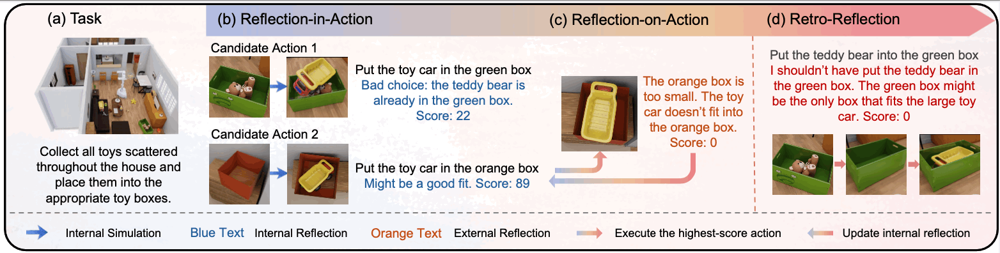

# Learning from Trials and Errors: Reflective Test-Time Planning for Embodied LLMs

<div align="center">

[](https://arxiv.org/abs/2602.21198)
[]([https://your-project-page.github.io](https://reflective-test-time-planning.github.io))
[](LICENSE)
[](https://www.python.org/downloads/)
[](https://pytorch.org/)
[](https://developer.nvidia.com/cuda-toolkit)

<h3>
<a href="https://arxiv.org/abs/2602.21198">📄 Paper</a> |
<a href="https://reflective-test-time-planning.github.io/">🌐 Project Page</a> |
<a href="#-citation">📖 Citation</a>
</h3>

**[Yining Hong¹](https://evelinehong.github.io/)** · **[Huang Huang](https://qingh097.github.io/)¹** · **[Manling Li²](https://limanling.github.io/)** · **[Li Fei-Fei¹](https://profiles.stanford.edu/fei-fei-li)** · **[Jiajun Wu¹](https://jiajunwu.com/)** · **[Yejin Choi¹](https://homes.cs.washington.edu/~yejin/)**

¹Stanford University · ²Northwestern University

---



</div>


## 🏠 BEHAVIOR-1K: Long-Horizon Household Tasks
Note: Unfortunately, due to BEHAVIOR environment restrictions, this experiment can only be running on 3090 / 4090, or two -80 series with some modifications. BEHAVIOR or OmniGibson doesn't support Blackwell GPUs.

<details open>
<summary><b>📋 Setup Instructions</b></summary>

### Step 1: Check CUDA Version

```bash
# Check CUDA version
nvcc --version
nvidia-smi
```

### Step 2: Navigate to BEHAVIOR Directory

```bash
cd BEHAVIOR
```

### Step 3: Configure CUDA Version

**⚠️ IMPORTANT**: Edit `setup.sh` and update the CUDA version to match your system.

```bash
# Open setup.sh with your preferred editor
nano setup.sh
# or
vim setup.sh
```

Find and modify the CUDA version line:
```bash
# Example: Change from
CUDA_VERSION="11.8"
# To your version:
CUDA_VERSION="12.1"  # Match your system's CUDA version
```

### Step 4: Run Setup Script

```bash
./setup.sh --new-env --omnigibson --bddl --dataset --primitives
```

This will:
- Create a new conda environment
- Install OmniGibson
- Install BDDL (Behavior Domain Definition Language)
- Download BEHAVIOR-1K dataset (~50GB)
- Install primitive actions

**Note**: Our version includes modifications to:
- `omnigibson.utils.object_state_utils.sample_kinematics` for improved object placement
- `setup.sh` for CUDA compatibility

### Step 5: Install BEHAVIOR Model

```bash
cd ../BEHAVIOR-model
pip install -e .
```

### Step 6: Verify Installation

```bash
python -c "import omnigibson as og; print(og.__version__)"
python -c "import omnigibson as og; print(og.DATASET_PATH)"
```

### Step 7: Run Inference

In BEHAVIOR-model folder, run:

```
bash ./inference_hybrid.sh full
```
For running other categories. Do:
```
bash ./inference_storage.sh full
bash ./inference_compare.sh full
bash ./inference_storage.sh full
```
full: running the full model. For running the ablations, replace full with vanilla | wo-ria | wo-roa | wo-value | wo-action. e.g.:
```
bash ./inference_hybrid.sh vanilla
```
Note: Right now we only provide a sample evaluation set. The full evaluation set will be released upon acceptance. 

### Step 8: Observe Results

You will see accuracy report like this when you finish the experiments:
```
Processed: 3/3
Completed (Right): 2
Failed (Wrong): 1
Crashed (Not counted): 0
Valid runs: 3
Accuracy: 66.7%
```
</details>

---

## 🗄️ MuJoCo Cupboard Fitting

<details open>
<summary><b>📋 Setup Instructions</b></summary>

### Step 1: Navigate to Cupboard Directory

```bash
cd cupboard
```

### Step 2: Create Virtual Environment

```bash
# Create virtual environment
python -m venv mujoco-env

# Activate environment
source mujoco-env/bin/activate  # On Linux/Mac
# mujoco-env\Scripts\activate  # On Windows
```

### Step 3: Install Package

```bash
pip install -e .
```

### Step 4: Test Interactive Environment

```bash
cd roboworld/envs
python franka_cupboard_interactive.py
```

### Step 5: Run Inference & Observe Results

This part is being cleaned right now and will be released later this year.

</details>

---


## 📖 Citation

If you find this work useful, please cite:

```bibtex
@article{hong2026reflective,
  title={Learning from Trials and Errors: Reflective Test-Time Planning for Embodied LLMs},
  author={Hong, Yining and Huang, Huang and Li, Manling and Fei-Fei, Li and Wu, Jiajun and Choi, Yejin},
  journal={arXiv preprint arXiv:2602.21198},
  year={2026}
}
```

</div>
